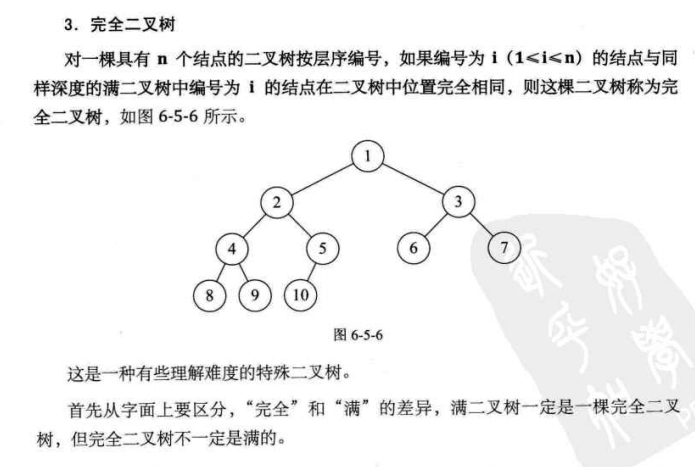

# 2019年第十届C/C++ B组蓝桥杯省赛真题

蓝桥杯历年真题及详细解答

- - - [第一题：组队(5分)](https://blog.csdn.net/kiwi_berrys/article/details/111263366#5_7)
        - [第二题：年号字符(5分)](https://blog.csdn.net/kiwi_berrys/article/details/111263366#5_53)
        - [第三题：数列求值（10分）](https://blog.csdn.net/kiwi_berrys/article/details/111263366#10_95)
        - [第四题：数的分解（10分）](https://blog.csdn.net/kiwi_berrys/article/details/111263366#10_129)
        - [第五题：迷宫（15分）](https://blog.csdn.net/kiwi_berrys/article/details/111263366#15_186)
        - [第六题：特别数的和（15分）](https://blog.csdn.net/kiwi_berrys/article/details/111263366#15_241)
        - [第七题：完全二叉树的权值（20分）](https://blog.csdn.net/kiwi_berrys/article/details/111263366#20_278)
        - [第八题：等差数列（20分）](https://blog.csdn.net/kiwi_berrys/article/details/111263366#20_307)
        - [第九题：后缀表达式（25分）](https://blog.csdn.net/kiwi_berrys/article/details/111263366#25_338)
        - [第十题：灵能传输（25分）](https://blog.csdn.net/kiwi_berrys/article/details/111263366#25_365)

## 第一题：组队(5分)

### **题目描述**

 作为篮球队教练，你需要从以下名单中选出 1号位至 5号位各一名球员，
 组成球队的首发阵容。
 每位球员担任 1号位至 5号位时的评分如下表所示。请你计算首发阵容 1
 号位至5号位的评分之和最大可能是多少？

做过了


## 第二题：年号字符(5分)

### 题目描述

小明用字母 A对应数字 1，B对应 2，以此类推，用 Z对应 26。对于 27以上的数字，小明用两位或更长位的字符串来对应，例如 AA对应27，AB对
应28，AZ对应52，LQ对应329。
请问2019对应的字符串是什么？

### 题目分析

这题就是类似于一个进制转换，你可以回想一下十进制转二进制如何转换，然后再想想将十进制转化成26进制，口诀就是除p取余

### 题目代码

## 第三题：数列求值（10分）

### 题目描述

给定数列1,1,1,3,5,9,17,…，从第4项开始，每项都是前3项的和。求
第20190324项的最后4位数字。

### 题目分析

用数组保存三项值，通过对3取余依次将数字加上去。应为保留最后四位数字，所以每次计算过后需要用10000取余，不然会溢出

### 题目代码

做过

## 第四题：数的分解（10分）

### 题目描述

把 2019分解成 3个各不相同的正整数之和，并且要求每个正整数都不包
含数字2和4，一共有多少种不同的分解方法？
注意交换 3个整数的顺序被视为同一种方法，例如 1000+1001+18和
1001+1000+18被视为同一种。

### 题目分析

暴力循环+位数判断

### 题目代码

passed

## 第五题：迷宫（15分）

### 题目描述

下图给出了一个迷宫的平面图，其中标记为 1 的为障碍，标记为 0 的为可
以通行的地方。
010000
000100
001001
110000
迷宫的入口为左上角，出口为右下角，在迷宫中，只能从一个位置走到这
个它的上、下、左、右四个方向之一。
对于上面的迷宫，从入口开始，可以按DRRURRDDDR 的顺序通过迷宫，
一共 10 步。其中 D、U、L、R 分别表示向下、向上、向左、向右走。
对于下面这个更复杂的迷宫（30 行 50 列） ，请找出一种通过迷宫的方式，
其使用的步数最少，在步数最少的前提下，请找出字典序最小的一个作为答案。
请注意在字典序中D<L<R<U。（如果你把以下文字复制到文本文件中，请务
必检查复制的内容是否与文档中的一致。在试题目录下有一个文件 maze.txt，
内容与下面的文本相同）
01010101001011001001010110010110100100001000101010
00001000100000101010010000100000001001100110100101
01111011010010001000001101001011100011000000010000
01000000001010100011010000101000001010101011001011
00011111000000101000010010100010100000101100000000
11001000110101000010101100011010011010101011110111
00011011010101001001001010000001000101001110000000
10100000101000100110101010111110011000010000111010
00111000001010100001100010000001000101001100001001
11000110100001110010001001010101010101010001101000
00010000100100000101001010101110100010101010000101
11100100101001001000010000010101010100100100010100
00000010000000101011001111010001100000101010100011
10101010011100001000011000010110011110110100001000
10101010100001101010100101000010100000111011101001
10000000101100010000101100101101001011100000000100
10101001000000010100100001000100000100011110101001
00101001010101101001010100011010101101110000110101
11001010000100001100000010100101000001000111000010
00001000110000110101101000000100101001001000011101
10100101000101000000001110110010110101101010100001
00101000010000110101010000100010001001000100010101
10100001000110010001000010101001010101011111010010
00000100101000000110010100101001000001000000000010
11010000001001110111001001000011101001011011101000
00000110100010001000100000001000011101000000110011
10101000101000100010001111100010101001010000001000
10000010100101001010110000000100101010001011101000
00111100001000010000000110111000000001000000001011
10000001100111010111010001000110111010101101111000

```

class Pos(object):
    def __init__(self, x, y, path):
        self.x = x
        self.y = y
        self.path = path

    def __str__(self):
        return self.path


def up(node):
    return Pos(node.x - 1, node.y, node.path + 'U')


def down(node):
    return Pos(node.x + 1, node.y, node.path + 'D')


def left(node):
    return Pos(node.x, node.y - 1, node.path + 'L')


def right(node):
    return Pos(node.x, node.y + 1, node.path + 'R')


if __name__ == '__main__':
    m = 0 # 列
    n = 0 # 行
    visited = set() #记录来过的地方
    map_int = [] # 地图数组
    queen = [] # 队列
    with open('./maze', mode='r', encoding='utf-8') as fp:
        #读取数据
        data = fp.readlines()
        for line in data:
            map_int.append(list(line.strip()))
        m = len(map_int)
        n = len(map_int[0])
        # 新建一个结点 坐标0,0 起始位置 此时 path=''
        pos = Pos(0, 0, '')
        # 此时的queen 装入 起点
        queen.append(pos)
        # 当 还有路可走
        while len(queen) != 0:
            # 当前移动的结点
            move_node = queen[0]
            # 这条路出队 开始尝试这条路的走法
            queen.pop(0)
            # 当前坐标表示为 
            move_str = (move_node.x,move_node.y)
            print(move_node)
            for q,i in enumerate(queen):
                print(q,i)
            #如果这地方没有来过
            if move_str not in visited:
                #加入集合 代表来过
                visited.add(move_str)
                #如果 达到了终点直接退出
                if move_node.x == m - 1 and move_node.y == n - 1:
                    print(move_node)
                    print(len(move_node.__str__()))
                    break
                # 如果 可以向下走 并且不在最下面
                if move_node.x < m - 1 and map_int[move_node.x + 1][move_node.y] == '0':
                    queen.append(down(move_node))
                # 如果可以向左走 并且不在最左边
                if move_node.y > 0 and map_int[move_node.x][move_node.y - 1] == '0':
                    queen.append(left(move_node))
                        # 如果可以向右走 并且不在最右边
                if move_node.y < n - 1 and map_int[move_node.x][move_node.y + 1] == '0':
                    queen.append(right(move_node))
                        # 如果可以向上走 并且不在最上边
                if move_node.x > 0 and map_int[move_node.x - 1][move_node.y] == '0':
                    queen.append(up(move_node))
        

```

## 第六题：特别数的和（15分）

### 题目描述

小明对数位中含有 2、0、1、9 的数字很感兴趣（不包括前导 0） ，在 1 到
40 中这样的数包括 1、2、9、10 至 32、39 和 40，共 28 个，他们的和是 574。
请问，在 1 到 n 中，所有这样的数的和是多少？
【输入格式】
输入一行包含两个整数 n。
【输出格式】
输出一行，包含一个整数，表示满足条件的数的和。
【样例输入】
40
【样例输出】
574
【评测用例规模与约定】
对于 20% 的评测用例，1 ≤ n ≤ 10。
对于 50% 的评测用例，1 ≤ n ≤ 100。
对于 80% 的评测用例，1 ≤ n ≤ 1000。
对于所有评测用例，1 ≤ n ≤ 10000。
【输出格式】
输出一个整数代表答案。
【样例输入】
7
1 6 5 4 3 2 1
试题G: 完全二叉树的权值 10
第十届蓝桥杯大赛软件类省赛 C/C++ 大学 B 组
【样例输出】
2
【评测用例规模与约定】
对于所有评测用例，1 ≤ N ≤ 100000，−100000 ≤ A i ≤ 100000。

### 题目分析

### 题目代码

## 第七题：完全二叉树的权值（20分）

### 题目描述

给定一棵包含 N 个节点的完全二叉树，树上每个节点都有一个权值，按从
上到下、从左到右的顺序依次是 A 1 , A 2 , ··· A N ，如下图所示：
现在小明要把相同深度的节点的权值加在一起，他想知道哪个深度的节点
权值之和最大？如果有多个深度的权值和同为最大，请你输出其中最小的深度。
注：根的深度是 1。
【输入格式】
第一行包含一个整数 N。
第二行包含 N 个整数 A 1 , A 2 , ··· A N 。
【输出格式】
输出一个整数代表答案。
【样例输入】
7
1 6 5 4 3 2 1
试题G: 完全二叉树的权值 10
第十届蓝桥杯大赛软件类省赛 C/C++ 大学 B 组
【样例输出】
2
【评测用例规模与约定】
对于所有评测用例，1 ≤ N ≤ 100000，−100000 ≤ A i ≤ 100000。

### 题目分析

这题是我不熟的二叉树,先来看看一些相关概念

#### 什么是完全二叉树?



接着,由于他要考虑的是同深度的和,很明显是一个顺序层级的遍历]

也還好,就是一个大概双指针的 切片

这里是降维打击了,拍成了一个数组,所以索引要注意是对的

### 题目代码

```
n=int(input())
treeNodes=list(map(int,input().split()))
depth=1
perRowSum=[]
curIndex=0
while 1:
    rowNodes=2**(depth-1)
    if curIndex<len(treeNodes):
        perRowSum.append(sum(treeNodes[curIndex:curIndex+rowNodes]))
    else:
        if curIndex!=len(treeNodes):
            perRowSum.append(sum(treeNodes[curIndex:]))
        break
    curIndex+=rowNodes
    depth+=1
print(perRowSum.index(max(perRowSum))+1)

```

这样可能AC不了,应该还能优化

## 第八题：等差数列（20分）

题目描述
数学老师给小明出了一道等差数列求和的题目。但是粗心的小明忘记了一
部分的数列，只记得其中 N 个整数。
现在给出这 N 个整数，小明想知道包含这 N 个整数的最短的等差数列有
几项？
【输入格式】
输入的第一行包含一个整数 N。
第二行包含 N 个整数 A 1 ,A 2 ,··· ,A N 。(注意 A 1 ∼ A N 并不一定是按等差数
列中的顺序给出)
【输出格式】
输出一个整数表示答案。
【样例输入】
5
2 6 4 10 20
【样例输出】
10
【样例说明】
包含 2、6、4、10、20 的最短的等差数列是 2、4、6、8、10、12、14、16、
18、20。

【评测用例规模与约定】
对于所有评测用例，2 ≤ N ≤ 100000，0 ≤ A i ≤ 10 9 。

### 题目分析

### 题目代码

------------------------------------------------
## 第九题：后缀表达式（25分）

题目描述
给定 N 个加号、M 个减号以及 N + M + 1 个整数 A 1 ,A 2 ,··· ,A N+M+1 ，小
明想知道在所有由这 N 个加号、M 个减号以及 N + M +1 个整数凑出的合法的
后缀表达式中，结果最大的是哪一个？
请你输出这个最大的结果。
例如使用1 2 3 + -，则 “2 3 + 1 -” 这个后缀表达式结果是 4，是最大的。
【输入格式】
第一行包含两个整数 N 和 M。
第二行包含 N + M + 1 个整数 A 1 ,A 2 ,··· ,A N+M+1 。
【输出格式】
输出一个整数，代表答案。
【样例输入】
1 1
1 2 3
【样例输出】
4
【评测用例规模与约定】
对于所有评测用例，0 ≤ N, M ≤ 100000，−10 9 ≤ A i ≤ 10 9 。

### 题目分析

### 题目代码