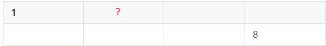
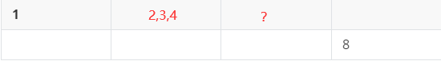
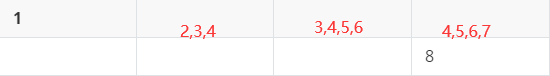
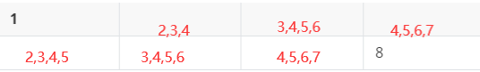

## 试题 A: 解密

【问题描述】
小明设计了一种文章加密的方法：对于每个字母 c，将它变成某个另外的
字符 T c 。下表给出了字符变换的规则：
字母 c T c 字母 c T c 字母 c T c 字母 c T c
a y n l A Y N L
b x o g B X O G
c m p o C M P O
d d q u D D Q U
e a r f E A R F
f c s s F C S S
g i t z G I T Z
h k u p H K U P
i n v w I N V W
j t w b J T W B
k j x r K J X R
l h y e L H Y E
m q z v M Q Z V
例如，将字符串 YeRi 加密可得字符串 EaFn。
小明有一个随机的字符串，加密后为
EaFnjISplhFviDhwFbEjRjfIBBkRyY
（由 30 个大小写英文字母组成，不包含换行符），请问原字符串是多少？
（如果你把以上字符串和表格复制到文本文件中，请务必检查复制的内容
是否与文档中的一致。在试题目录下有一个文件 str.txt，第一行为上面的字符
串，后面 52 行依次为表格中的内容。）
【答案提交】
这是一道结果填空题，你只需要算出结果后提交即可。本题的结果为一个
只包含 30 个大小写英文字母的字符串，在提交答案时只填写这个字符串，填写
多余的内容将无法得分。


## 试题 B: 纪念日

【问题描述】
2020 年 7 月 1 日是中国共产党成立 99 周年纪念日。
中国共产党成立于 1921 年 7 月 23 日。
请问从 1921 年 7 月 23 日中午 12 时到 2020 年 7 月 1 日中午 12 时一共包
含多少分钟？
【答案提交】
这是一道结果填空题，你只需要算出结果后提交即可。本题的结果为一个
整数，在提交答案时只填写这个整数，填写多余的内容将无法得分


考察datetime的使用

```
import datetime

start=datetime.datetime(1921,7,23)
end=datetime.datetime(2020,7,1,)
print(((end-start).days+12)*24*60)
```

## 试题 C: REPEAT 程序

【问题描述】
附件 prog.txt 中是一个用某种语言写的程序。
其中 REPEAT k 表示一个次数为 k 的循环。循环控制的范围由缩进表达，
从次行开始连续的缩进比该行多的（前面的空白更长的）为循环包含的内容。
例如如下片段：
REPEAT 2:
A = A + 4
REPEAT 5:
REPEAT 6:
A = A + 5
A = A + 7
A = A + 8
A = A + 9
该片段中从 A = A + 4 所在的行到 A = A + 8 所在的行都在第一行的
循环两次中。
REPEAT 6: 所在的行到 A = A + 7 所在的行都在 REPEAT 5: 循环中。
A = A + 5 实际总共的循环次数是 2 × 5 × 6 = 60 次。
请问该程序执行完毕之后，A 的值是多少？
【答案提交】
这是一道结果填空题，你只需要算出结果后提交即可。本题的结果为一个
整数，在提交答案时只填写这个整数，填写多余的内容将无法得分。

**这里缺失了缩进**，我这题做不了

不过应该是这样的

```
A=0
for i in range(2):
    A+=4
    for j in range(5):
        for k in range(6):
            A+=5
            A+=7
    A+=8
    A+=9

```


## 试题 D: 矩阵

【问题描述】
把 1 ∼ 2020 放在 2 × 1010 的矩阵里。要求同一行中右边的比左边大，同一
列中下边的比上边的大。一共有多少种方案？
答案很大，你只需要给出方案数除以 2020 的余数即可。
【答案提交】
这是一道结果填空题，你只需要算出结果后提交即可。本题的结果为一个
整数，在提交答案时只填写这个整数，填写多余的内容将无法得分。


考虑最简单的情况

| 1    | 2    |
| ---- | ---- |
| 3    | 4    |

上面这种只有一种情况

那么加一列试试

可以写出这样

| 1    | 2    | 5    |
| ---- | ---- | ---- |
| 3    | 4    | 6    |

| 1    | 2    | 4    |
| ---- | ---- | ---- |
| 3    | 5    | 6    |

| 1    | 2    | 3    |
| ---- | ---- | ---- |
| 4    | 5    | 6    |

| 1    | 3    | 5    |
| ---- | ---- | ---- |
| 2    | 4    | 6    |

| 1    | 3    | 4    |
| ---- | ---- | ---- |
| 2    | 5    | 6    |

找到规律了吗?

再加一列

| 1    |      |      |      |
| ---- | ---- | ---- | ---- |
|      |      |      | 8    |

我们可以卡纳都左上角和右下角的数字不变，其他数字做一个组合

那么



问号这一格能填什么呢？根据上面的经验，他至少可以填2,3,4

也就是3种可能


那么下一个格子这个呢？很明显可以填 3,4,5,6



那么下一个格子理所应当的取值范围是这样的



接着这样规律写完就是



所以不太会的样子，跳过


原来是dp，等我学完dp就回来干死你

草

