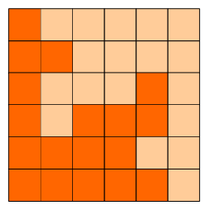
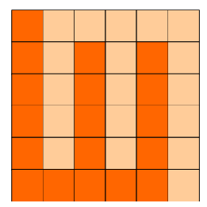
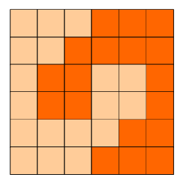
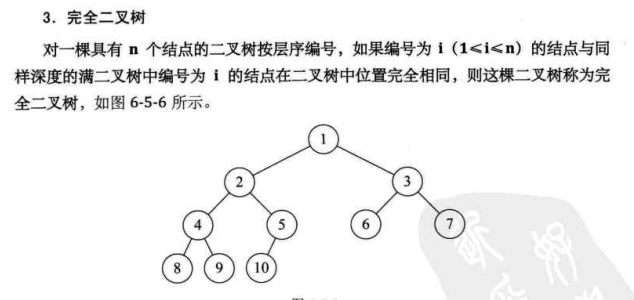

## 1.1 方格分割

6x6的方格，沿着格子的边线剪开成两部分。
要求这两部分的形状完全相同。

如图：p1.png, p2.png, p3.png 就是可行的分割法。

试计算：
包括这3种分法在内，一共有多少种不同的分割方法。
注意：旋转对称的属于同一种分割法。

请提交该整数，不要填写任何多余的内容或说明文字。

    

这题很显然，我没有思路

## 1.2 迷宫

X星球的一处迷宫游乐场建在某个小山坡上。

它是由10x10相互连通的小房间组成的。

房间的地板上写着一个很大的字母。

我们假设玩家是面朝上坡的方向站立，则：

L表示走到左边的房间，

R表示走到右边的房间，

U表示走到上坡方向的房间，

D表示走到下坡方向的房间。

X星球的居民有点懒，不愿意费力思考。

他们更喜欢玩运气类的游戏。这个游戏也是如此！

开始的时候，直升机把100名玩家放入一个个小房间内。

玩家一定要按照地上的字母移动。

迷宫地图如下：

UDDLUULRUL

UURLLLRRRU

RRUURLDLRD

RUDDDDUUUU

URUDLLRRUU

DURLRLDLRL

ULLURLLRDU

RDLULLRDDD

UUDDUDUDLL

ULRDLUURRR

请你计算一下，最后，有多少玩家会走出迷宫?

而不是在里边兜圈子。

请提交该整数，表示走出迷宫的玩家数目，不要填写任何多余的内容。

如果你还没明白游戏规则，可以参看一个简化的4x4迷宫的解说图：

  

## 1.3 15.125GB

【问题描述】
在计算机存储中，15.125GB是多少MB？
【答案提交】
这是一道结果填空的题，你只需要算出结果后提交即可。本题的结果为一个整数，在提交答案时只填写这个整数，填写多余的内容将无法得分。

> 1KiB（Kilobyte）=1024B ，即2的10次方字节zd，读音“千字节”
> 1MiB（Megabyte）=1024KiB，即2的20次方字内节，读音“兆字节”
> 1GiB（Gigabyte）=1024MiB，即2的30次方字节，读音“吉字节”
> 1TiB（Terabyte）=1024GiB，即2的40次方字节容，读音“太字节”
> 1PiB（Petabyte）=1024TiB，即2的50次方字节，读音“拍字节”
> 1EiB（Exabyte） =1024PiB，即2的60次方字节，读音“艾字节”
> 1ZiB（Zettabyte）=1024EiB，即2的70次方字节，读音“Z字节”
> 1YiB（Yottabyte）=1024ZiB，即2的80次方字节，读音“Y字节
> 比特(bit)是最小的存储单位。
> 计算机存储单位一般用字节(Byte)、千字节(KB)、兆字节(MB)、吉字节(GB)、太字节(TB)、拍字节(PB)、艾字节(EB)、泽它字节(ZB，又称皆字节)、尧它字节(YB)表示。
> ------------------------------------------------
> 版权声明：本文为CSDN博主「大聪明Smart」的原创文章，遵循CC 4.0 BY-SA版权协议，转载请附上原文出处链接及本声明。
> 原文链接：https://blog.csdn.net/qq_31910669/article/details/106073617

```
capacity = 15.125 * 1024

print(capacity)
```

## 1.4. 约数个数

【问题描述】
1200000有多少个约数（只计算正约数）。
【答案提交】
这是一道结果填空的题，你只需要算出结果后提交即可。本题的结果为一个整数，在提交答案时只填写这个整数，填写多余的内容将无法得分。

> 约数，又叫因数。整数a除以整数b(b≠0) 除得的商正好是整数而没有余数，我们就说a能被b整除，或b能整除a。a称为b的倍数，b称为a的约数。在自然数（0和正整数）的范围内，任何正整数都是0的约数。4的正约数有：1、2、4。6的正约数有：1、2、3、6。10的正约数有：1、2、5、10。12的正约数有：1、2、3、41215的正约数有：1、3、5、15。18的正约数有：1、2、3、6、9、18。20的正约数有：1、2、4、5、10、20。注意：一个数的约数必然包括1及其本身。
>
> 

也是送分题，懒得做

```
count = 2  # 1 and itself

num = 1200000

for i in range(2, num):  # From 2 to num - 1
    if num % i == 0:
        count += 1
        # print(i, end=' ')  # Show all divisors

print(count)
```


## 1.5. 叶结点数

【问题描述】
一棵包含有2019个结点的二叉树，最多包含多少个叶结点？
【答案提交】
这是一道结果填空的题，你只需要算出结果后提交即可。本题的结果为一个整数，在提交答案时只填写这个整数，填写多余的内容将无法得分。

这题实际上就是求完全二叉树的叶子结点

因为是 **最多** 饱含多少叶节点，那么，AKA 完全二叉树的性质就决定了他这个最多嗷




因为他会布满所有的孩子直到达到上限。

意思就是，我们需要算到2019结点时，那一层的叶结点数和上一层 出度为0  的结点数

现在看看，2019个结点，很明显这棵树是 11层的，这一层剩下的结点很明显是2019-1023=996个

那么上一层是第十层 这一层有512个结点

那么，第十层还有 512-996/2=512-498=14个出度为0 的结点

所以只要用996+14=1010 就是答案

好一点的做法是这样的

```
def most_leaf_nodes(total):

    layer = 0

    while 2 ** layer - 1 < total:
        layer += 1

    now_layer = layer - 1

    now_layer_nodes = 2 ** (layer - 2)

    now_total_nodes = 2 ** (layer - 1) - 1

    left_nodes = total - now_total_nodes

    leaf_nodes = now_layer_nodes - (left_nodes // 2 + left_nodes % 2) + left_nodes

    return leaf_nodes


print(most_leaf_nodes(2019))


```

接下来看这道题

**面试题**：如果一个完全二叉树的结点总数为768个，求叶子结点的个数。

由二叉树的性质知：n0=n2+1，将之带入768=n0+n1+n2中得：768=n1+2n2+1，因为完全二叉树度为1的结点个数要么为0，要么为1，那么就把n1=0或者1都代入公式中，很容易发现n1=1才符合条件。所以算出来n2=383，所以叶子结点个数n0=n2+1=384。

**总结规律**：如果一棵完全二叉树的结点总数为n，那么叶子结点等于n/2（当n为偶数时）或者(n+1)/2（当n为奇数时）

额，更变态的做法是这样的

```
n=int(input())
print(n//2 if n%2==0 else (n+1)//2)
```

## 1.6. 数字9

【问题描述】
在1至2019中，有多少个数的数位中包含数字9？
注意，有的数中的数位中包含多个9，这个数只算一次。例如，1999这个数包含数字9，在计算只是算一个数。
【答案提交】
这是一道结果填空的题，你只需要算出结果后提交即可。本题的结果为一个整数，在提交答案时只填写这个整数，填写多余的内容将无法得分。
------------------------------------------------
送分力

```
c=0
for i in range(1,2020):
    if '9' in str(i):
        c+=1
print(c)

```


## 1.7. 数位递增的数

【问题描述】
一个正整数如果任何一个数位不大于右边相邻的数位，则称为一个数位递增的数，例如1135是一个数位递增的数，而1024不是一个数位递增的数。
给定正整数 n，请问在整数 1 至 n 中有多少个数位递增的数？
【输入格式】
输入的第一行包含一个整数 n。
【输出格式】
输出一行包含一个整数，表示答案。
【样例输入】
30
【样例输出】
26
【评测用例规模与约定】
对于 40% 的评测用例，1 <= n <= 1000。
对于 80% 的评测用例，1 <= n <= 100000。
对于所有评测用例，1 <= n <= 1000000。

------------------------------------------------


### 第一种，暴力法

```
n=int(input())
c=0
for i in range(1,n+1):
    s=str(i)
    t=s[0]
    f=True
    for j in s[1:]:
        if j>=t:
            t=j
            f=True
            continue
        else:
            f=False
            break
    if f:
##        print(s)
        c+=1
    
print(c)

```


