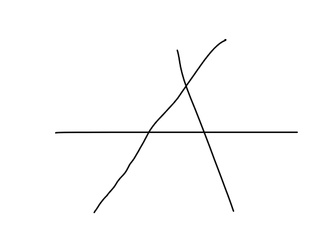

第十一届蓝桥杯 的真题额，赶紧试一试

  

## 贴门牌号

找1，2020之间的数中包含2的数的个数

```
c=0
for i in range(1,2021):
    if '2' in str(i):
        c+=1
print(c)
```

##  2020

  

 给了一个300行300列的0和2数据，横着竖着斜着找有多少个2020 

这个看起来没那么好做

为了模拟一下这个场景，我们生成一个10行10列的试一试


首先 横着很好找

```
for i in s.splitlines():
    print(len(i.split('2020')))
```

竖着就要用这样的方法了， 总之我是学到了


> https://blog.csdn.net/qq_36512295/article/details/94210180


真的牛

```
def transformMatrix(m):
    # 逆向参数收集，将矩阵中多个列表转换成多个参数，传给 zip
    print(*m)
    return list(zip(*m))
```

用zip一下就搞定了，解包后传进出来就搞一下就行了

```
s="""0020002200
2220200202
2222000202
0202202002
0022202000
0002022222
0202022002
0220022020
0022222200
0020202002
"""
def transformMatrix(m):
    # 逆向参数收集，将矩阵中多个列表转换成多个参数，传给 zip
    print(*m)
    return list(zip(*m))

for i in s.splitlines():
    print(i.count('2020'))
s2=transformMatrix([list(i) for i in s.splitlines()])
print(s2)
for sen in s2:
    print( ''.join(sen).count('2020'))

```

至于斜着怎么找，是有点难度了吗？

很直观的方法就是遍历每一条斜线，

用上次八皇后的技巧，遍历每一条斜线，一定要记住，很重要！

```
    i, j = row-1 , k2
    while i>=0 and j>=0:

        t+=sl[i][j]
        i,j = i-1,j-1
```

```
    i,j = row - 1, k2
    while i>=0 and j<col:
        t+=sl[i][j]
        i,j = i-1,j+1
```

模板大概是上面这样的，i和j是二维数组开始遍历的位置

如果想要直接从最后一行开始，直接把i 令 row-1 然后  k2就是每一列的变量

最后就是这样


```
s="""0020002200
2220200202
2222000202
0202202002
0022202000
0002022222
0202022002
0220022020
0022222200
0020202002
"""
def transformMatrix(m):
    # 逆向参数收集，将矩阵中多个列表转换成多个参数，传给 zip

    return list(zip(*m))
sl=[]
rowN=0
colN=0
for i in s.splitlines():
    rowN+=i.count('2020')
    sl.append(list(i))
s2=transformMatrix([list(i) for i in s.splitlines()])

for sen in sl:
    colN+= ''.join(sen).count('2020')

row=len(sl)
col=row

print(s)
obliqueCount=0
for k2 in range(col):
    i, j = row-1 , k2
    t=''
    while i>=0 and j>=0:

        t+=sl[i][j]
        i,j = i-1,j-1
    # 左上斜线
    obliqueCount+=t.count('2020')

    t=''
    i,j = row - 1, k2
    while i>=0 and j<col:
        t+=sl[i][j]
        i,j = i-1,j+1
#     右上斜线
    obliqueCount += t.count('2020')
print(obliqueCount)
```

就是只能这样了

不要较真，这个不是认真做的，所以额。只是为了检验一下有没有思路和大概的样子。

## 跑步

  

说小蓝从2000年几月几号跑的那天是星期几（记不清了），包含这天，一直跑到2020年10月1号（也包含这天）。其中每个月的1号跑2000米，逢周一也跑2000米，赶巧是1号也是周一也是跑2000米，其余的日子跑1000米，问一共跑了多少千米。

这题如果常规入手会非常难，所以用一下python自带的日期库就舒服很多了

哈哈

由于题目无了，我们从2000 6 3 开始跑

```
import datetime

start=datetime.datetime(2000,6,3)
end=datetime.datetime(2020,10,1)
```

那么怎么判断每一个月的1号和周一呢？

先用strftime来判断是start那一天是星期几，然后一个取余循环就行

```
print(start.strftime('%a %b %d %H:%M'))
```

```
Sat Jun 03 00:00
```

知道是星期6，那么day就是6

然后这样就出来了

记得

```
delta1=datetime.timedelta(1)
```

是用来日期的加减运算的，所以要初始化这个timedelta

```
import datetime

start=datetime.datetime(2000,6,3)
end=datetime.datetime(2020,10,1)
run=0
delta=end-start
delta1=datetime.timedelta(1)
day=6


for i in range(delta.days):
    start+=delta1
    day+=1
    if start.day==1 or day%7==1:
        run+=2
        day=1
    else:
        run += 1  # 1000米
print(run)
```


## 排序

  

  

找出冒牌排序交换次数为100的字符串序列，最短，只有小写字母，不重复

我是把他逆序，因为最小的放在最后边他移动的次数最多，这样保证字符串最短，最后到了o，但是o不在最后，在倒数几个位置


有点意思了

字符的排序一般都是按照ascii的顺序来的，找一个100次的交换的话，就直接从逆向做起呗

首先写一个冒泡，再一个个试出来的，哈哈哈

```
string=[chr(i) for i in range(ord('o'),ord('a')-1,-1)]
string[0],string[-12]=string[-12],string[0]

def bubbleSort():
    count=0    
    for i in range(len(string)):
        for j in range(len(string)-i-1):
##            print(i,j)
            if string[j+1]<string[j]:
                string[j+1],string[j]=string[j],string[j+1]
                count+=1
    print(string)        
    print(count)            
print(string)
bubbleSort()


```

```
['l', 'n', 'm', 'o', 'k', 'j', 'i', 'h', 'g', 'f', 'e', 'd', 'c', 'b', 'a']
['a', 'b', 'c', 'd', 'e', 'f', 'g', 'h', 'i', 'j', 'k', 'l', 'm', 'n', 'o']
100
```


## 蛇皮走位


这样的矩阵

```
1	2	6	7	15...
3	5	8	14...
4	9	13...
10	12...
11...
...
123456
```

求第20行20列的数是几


可以用笔算。。。


有了N皇后 斜线处理的基础，感觉 就有点意思了 做出来了

```
N = 40# int(input())
martix = [[1 for i in range(N)] for i in range(N)]

t = 1  # 斜着的数字
for i in range(N):

    if i%2==1:
        col = i
        row = 0
        while col >= 0 and row < N:

            martix[row][col] = t
            col -= 1
            row += 1
            t += 1
    else:
        col = 0
        row = i
        while col <=N and row >= 0:

            martix[row][col] = t
            col += 1
            row -= 1
            t += 1

for m in martix:
    print(m)
print(martix[19][19])
```


```
[1, 2, 6, 7, 15, 16, 28, 29, 45, 46, 66, 67, 91, 92, 120, 121, 153, 154, 190, 191, 231, 232, 276, 277, 325, 326, 378, 379, 435, 436, 496, 497, 561, 562, 630, 631, 703, 704, 780, 781]
[3, 5, 8, 14, 17, 27, 30, 44, 47, 65, 68, 90, 93, 119, 122, 152, 155, 189, 192, 230, 233, 275, 278, 324, 327, 377, 380, 434, 437, 495, 498, 560, 563, 629, 632, 702, 705, 779, 782, 1]
[4, 9, 13, 18, 26, 31, 43, 48, 64, 69, 89, 94, 118, 123, 151, 156, 188, 193, 229, 234, 274, 279, 323, 328, 376, 381, 433, 438, 494, 499, 559, 564, 628, 633, 701, 706, 778, 783, 1, 1]
[10, 12, 19, 25, 32, 42, 49, 63, 70, 88, 95, 117, 124, 150, 157, 187, 194, 228, 235, 273, 280, 322, 329, 375, 382, 432, 439, 493, 500, 558, 565, 627, 634, 700, 707, 777, 784, 1, 1, 1]
[11, 20, 24, 33, 41, 50, 62, 71, 87, 96, 116, 125, 149, 158, 186, 195, 227, 236, 272, 281, 321, 330, 374, 383, 431, 440, 492, 501, 557, 566, 626, 635, 699, 708, 776, 785, 1, 1, 1, 1]
[21, 23, 34, 40, 51, 61, 72, 86, 97, 115, 126, 148, 159, 185, 196, 226, 237, 271, 282, 320, 331, 373, 384, 430, 441, 491, 502, 556, 567, 625, 636, 698, 709, 775, 786, 1, 1, 1, 1, 1]
[22, 35, 39, 52, 60, 73, 85, 98, 114, 127, 147, 160, 184, 197, 225, 238, 270, 283, 319, 332, 372, 385, 429, 442, 490, 503, 555, 568, 624, 637, 697, 710, 774, 787, 1, 1, 1, 1, 1, 1]
[36, 38, 53, 59, 74, 84, 99, 113, 128, 146, 161, 183, 198, 224, 239, 269, 284, 318, 333, 371, 386, 428, 443, 489, 504, 554, 569, 623, 638, 696, 711, 773, 788, 1, 1, 1, 1, 1, 1, 1]
[37, 54, 58, 75, 83, 100, 112, 129, 145, 162, 182, 199, 223, 240, 268, 285, 317, 334, 370, 387, 427, 444, 488, 505, 553, 570, 622, 639, 695, 712, 772, 789, 1, 1, 1, 1, 1, 1, 1, 1]
[55, 57, 76, 82, 101, 111, 130, 144, 163, 181, 200, 222, 241, 267, 286, 316, 335, 369, 388, 426, 445, 487, 506, 552, 571, 621, 640, 694, 713, 771, 790, 1, 1, 1, 1, 1, 1, 1, 1, 1]
[56, 77, 81, 102, 110, 131, 143, 164, 180, 201, 221, 242, 266, 287, 315, 336, 368, 389, 425, 446, 486, 507, 551, 572, 620, 641, 693, 714, 770, 791, 1, 1, 1, 1, 1, 1, 1, 1, 1, 1]
[78, 80, 103, 109, 132, 142, 165, 179, 202, 220, 243, 265, 288, 314, 337, 367, 390, 424, 447, 485, 508, 550, 573, 619, 642, 692, 715, 769, 792, 1, 1, 1, 1, 1, 1, 1, 1, 1, 1, 1]
[79, 104, 108, 133, 141, 166, 178, 203, 219, 244, 264, 289, 313, 338, 366, 391, 423, 448, 484, 509, 549, 574, 618, 643, 691, 716, 768, 793, 1, 1, 1, 1, 1, 1, 1, 1, 1, 1, 1, 1]
[105, 107, 134, 140, 167, 177, 204, 218, 245, 263, 290, 312, 339, 365, 392, 422, 449, 483, 510, 548, 575, 617, 644, 690, 717, 767, 794, 1, 1, 1, 1, 1, 1, 1, 1, 1, 1, 1, 1, 1]
[106, 135, 139, 168, 176, 205, 217, 246, 262, 291, 311, 340, 364, 393, 421, 450, 482, 511, 547, 576, 616, 645, 689, 718, 766, 795, 1, 1, 1, 1, 1, 1, 1, 1, 1, 1, 1, 1, 1, 1]
[136, 138, 169, 175, 206, 216, 247, 261, 292, 310, 341, 363, 394, 420, 451, 481, 512, 546, 577, 615, 646, 688, 719, 765, 796, 1, 1, 1, 1, 1, 1, 1, 1, 1, 1, 1, 1, 1, 1, 1]
[137, 170, 174, 207, 215, 248, 260, 293, 309, 342, 362, 395, 419, 452, 480, 513, 545, 578, 614, 647, 687, 720, 764, 797, 1, 1, 1, 1, 1, 1, 1, 1, 1, 1, 1, 1, 1, 1, 1, 1]
[171, 173, 208, 214, 249, 259, 294, 308, 343, 361, 396, 418, 453, 479, 514, 544, 579, 613, 648, 686, 721, 763, 798, 1, 1, 1, 1, 1, 1, 1, 1, 1, 1, 1, 1, 1, 1, 1, 1, 1]
[172, 209, 213, 250, 258, 295, 307, 344, 360, 397, 417, 454, 478, 515, 543, 580, 612, 649, 685, 722, 762, 799, 1, 1, 1, 1, 1, 1, 1, 1, 1, 1, 1, 1, 1, 1, 1, 1, 1, 1]
[210, 212, 251, 257, 296, 306, 345, 359, 398, 416, 455, 477, 516, 542, 581, 611, 650, 684, 723, 761, 800, 1, 1, 1, 1, 1, 1, 1, 1, 1, 1, 1, 1, 1, 1, 1, 1, 1, 1, 1]
[211, 252, 256, 297, 305, 346, 358, 399, 415, 456, 476, 517, 541, 582, 610, 651, 683, 724, 760, 801, 1, 1, 1, 1, 1, 1, 1, 1, 1, 1, 1, 1, 1, 1, 1, 1, 1, 1, 1, 1]
[253, 255, 298, 304, 347, 357, 400, 414, 457, 475, 518, 540, 583, 609, 652, 682, 725, 759, 802, 1, 1, 1, 1, 1, 1, 1, 1, 1, 1, 1, 1, 1, 1, 1, 1, 1, 1, 1, 1, 1]
[254, 299, 303, 348, 356, 401, 413, 458, 474, 519, 539, 584, 608, 653, 681, 726, 758, 803, 1, 1, 1, 1, 1, 1, 1, 1, 1, 1, 1, 1, 1, 1, 1, 1, 1, 1, 1, 1, 1, 1]
[300, 302, 349, 355, 402, 412, 459, 473, 520, 538, 585, 607, 654, 680, 727, 757, 804, 1, 1, 1, 1, 1, 1, 1, 1, 1, 1, 1, 1, 1, 1, 1, 1, 1, 1, 1, 1, 1, 1, 1]
[301, 350, 354, 403, 411, 460, 472, 521, 537, 586, 606, 655, 679, 728, 756, 805, 1, 1, 1, 1, 1, 1, 1, 1, 1, 1, 1, 1, 1, 1, 1, 1, 1, 1, 1, 1, 1, 1, 1, 1]
[351, 353, 404, 410, 461, 471, 522, 536, 587, 605, 656, 678, 729, 755, 806, 1, 1, 1, 1, 1, 1, 1, 1, 1, 1, 1, 1, 1, 1, 1, 1, 1, 1, 1, 1, 1, 1, 1, 1, 1]
[352, 405, 409, 462, 470, 523, 535, 588, 604, 657, 677, 730, 754, 807, 1, 1, 1, 1, 1, 1, 1, 1, 1, 1, 1, 1, 1, 1, 1, 1, 1, 1, 1, 1, 1, 1, 1, 1, 1, 1]
[406, 408, 463, 469, 524, 534, 589, 603, 658, 676, 731, 753, 808, 1, 1, 1, 1, 1, 1, 1, 1, 1, 1, 1, 1, 1, 1, 1, 1, 1, 1, 1, 1, 1, 1, 1, 1, 1, 1, 1]
[407, 464, 468, 525, 533, 590, 602, 659, 675, 732, 752, 809, 1, 1, 1, 1, 1, 1, 1, 1, 1, 1, 1, 1, 1, 1, 1, 1, 1, 1, 1, 1, 1, 1, 1, 1, 1, 1, 1, 1]
[465, 467, 526, 532, 591, 601, 660, 674, 733, 751, 810, 1, 1, 1, 1, 1, 1, 1, 1, 1, 1, 1, 1, 1, 1, 1, 1, 1, 1, 1, 1, 1, 1, 1, 1, 1, 1, 1, 1, 1]
[466, 527, 531, 592, 600, 661, 673, 734, 750, 811, 1, 1, 1, 1, 1, 1, 1, 1, 1, 1, 1, 1, 1, 1, 1, 1, 1, 1, 1, 1, 1, 1, 1, 1, 1, 1, 1, 1, 1, 1]
[528, 530, 593, 599, 662, 672, 735, 749, 812, 1, 1, 1, 1, 1, 1, 1, 1, 1, 1, 1, 1, 1, 1, 1, 1, 1, 1, 1, 1, 1, 1, 1, 1, 1, 1, 1, 1, 1, 1, 1]
[529, 594, 598, 663, 671, 736, 748, 813, 1, 1, 1, 1, 1, 1, 1, 1, 1, 1, 1, 1, 1, 1, 1, 1, 1, 1, 1, 1, 1, 1, 1, 1, 1, 1, 1, 1, 1, 1, 1, 1]
[595, 597, 664, 670, 737, 747, 814, 1, 1, 1, 1, 1, 1, 1, 1, 1, 1, 1, 1, 1, 1, 1, 1, 1, 1, 1, 1, 1, 1, 1, 1, 1, 1, 1, 1, 1, 1, 1, 1, 1]
[596, 665, 669, 738, 746, 815, 1, 1, 1, 1, 1, 1, 1, 1, 1, 1, 1, 1, 1, 1, 1, 1, 1, 1, 1, 1, 1, 1, 1, 1, 1, 1, 1, 1, 1, 1, 1, 1, 1, 1]
[666, 668, 739, 745, 816, 1, 1, 1, 1, 1, 1, 1, 1, 1, 1, 1, 1, 1, 1, 1, 1, 1, 1, 1, 1, 1, 1, 1, 1, 1, 1, 1, 1, 1, 1, 1, 1, 1, 1, 1]
[667, 740, 744, 817, 1, 1, 1, 1, 1, 1, 1, 1, 1, 1, 1, 1, 1, 1, 1, 1, 1, 1, 1, 1, 1, 1, 1, 1, 1, 1, 1, 1, 1, 1, 1, 1, 1, 1, 1, 1]
[741, 743, 818, 1, 1, 1, 1, 1, 1, 1, 1, 1, 1, 1, 1, 1, 1, 1, 1, 1, 1, 1, 1, 1, 1, 1, 1, 1, 1, 1, 1, 1, 1, 1, 1, 1, 1, 1, 1, 1]
[742, 819, 1, 1, 1, 1, 1, 1, 1, 1, 1, 1, 1, 1, 1, 1, 1, 1, 1, 1, 1, 1, 1, 1, 1, 1, 1, 1, 1, 1, 1, 1, 1, 1, 1, 1, 1, 1, 1, 1]
[820, 1, 1, 1, 1, 1, 1, 1, 1, 1, 1, 1, 1, 1, 1, 1, 1, 1, 1, 1, 1, 1, 1, 1, 1, 1, 1, 1, 1, 1, 1, 1, 1, 1, 1, 1, 1, 1, 1, 1]
761

Process finished with exit code 0

```


## 成绩合格率优秀率

  

至少60 为及格
 至少85为优秀
 算及格率和优秀率
 输入第一行为n，代表几个人的乘积，下边n行，为每个人的乘积,保证输入的都是整数>=0
 输出两行 分别为及格率和优秀率，四舍五入
 例如：
 7
 60
 71
 100
 88
 98
 0
 67

输出

86%
 43%

这题看上去挺简单的

```
n=int(input())
scores=[int(input()) for i in range(n)]
qualified=[s for s in scores if s>=60]
excellent=[s for s in scores if s>=85]
print('{}%'.format(round(len(qualified)/len(scores))))
print('{}%'.format(round(len(excellent)/len(scores))))
```

实际上也是挺简单的


## 平面切分

  

直线由y = Ax + B 确定
 输入不同的A B
 然后判断这些线把平面分成了几部分
 样例
 3
 1 1
 2 2
 3 3
 输出
 6

这种题呢，应该是看交点的个数，交点和切割平面有这样的关系

交点=0时 2个平面


交点=1时 4个平面


交点=2时 6个平面


交点=3时 7 个平面 


交点=4时  8个平面


都是很显然的，那么，有什么规律呢？

暂时没看出来，而且题目给定的是直线 Ax+b，所以还有没有别的更好的方法呢?

注意到如果出现所有线平行的情况，即


此时可以直接返回结果，就是 N +1 的部分

如果是所有线   于一点，就是这样


就是 2*N的部分

那么如果是2个或者2个交点以上呢？注意这里的交点是指两两之间的交点！！而不是上面那个样子的




很明显是 2*N+1

那么接下来就是计算他们之间的交点了

那么如何计算给出直线的交点呢？只需要看看他们的令y 或者x相等时，值是不是一样的了

注意是两两相交的交点，也就是要遍历 n（n-1） 次

这题也不是难的，主要是判断出两直线相交的一些规律而已

```

lines=[]
point=set()

class line():
    def __init__(self, a, b):
        self.b = b
        self.a = a
def findThePointOfIntersection(n):
    f=1
    for i in range(n):
        for j in range(i+1,n):
            if lines[i].a!=lines[j].a: #即斜率不一样，是平行的时候
                f=0
                x=-(lines[i].b-lines[j].b)/(lines[i].a-lines[j].b)
                y=lines[i].a*x+lines[i].b
                point.add((x,y))
                break
    if f:
        #都是平行的
        return n+1
    else:
        if len(point)==1:
            return 2*n
        else:
            return 2*n+1
n=int(input())
for i in range(n):
    a,b=list(map(int,input().split()))
    lines.append(line(a,b))
print(findThePointOfIntersection(n))

```

## 单词分析

 

  

这题在python充分的方法面前，都弱成渣了

暴力一下应该过了

```
string=input()
letters={chr(i):0 for i in range(ord('a'),ord('z'))}
print(letters)
for alpha in string:
    letters[alpha]+=1
print(letters)
print(list(letters.keys())[list(letters.values()).index(max(letters.values()))])


```

```
asinodia
{'a': 0, 'b': 0, 'c': 0, 'd': 0, 'e': 0, 'f': 0, 'g': 0, 'h': 0, 'i': 0, 'j': 0, 'k': 0, 'l': 0, 'm': 0, 'n': 0, 'o': 0, 'p': 0, 'q': 0, 'r': 0, 's': 0, 't': 0, 'u': 0, 'v': 0, 'w': 0, 'x': 0, 'y': 0}
{'a': 2, 'b': 0, 'c': 0, 'd': 1, 'e': 0, 'f': 0, 'g': 0, 'h': 0, 'i': 2, 'j': 0, 'k': 0, 'l': 0, 'm': 0, 'n': 1, 'o': 1, 'p': 0, 'q': 0, 'r': 0, 's': 1, 't': 0, 'u': 0, 'v': 0, 'w': 0, 'x': 0, 'y': 0}
a
```


## 数字三角形

  

   

类似于这个

```
        3
      4   5
    6   7   8
    ...
```

 然后从上边走到底层，只有向左下或右下，且最多相差1，最后累计路线上的值，求最大的。 


我们先把这个金字塔打印出来额

```
start=3
n=5
# n=1
# 3

 # n=2
# 3
#4 5

# n=3
#  3
# 4 5
#6 7 8

# n-1个空格
for i in range(n):
    print(''.join([' ' for j in range(n-i-1)]),end='')
    for j in range(i+1):
        print(' ', end='')
        print(start,end='')
        start+=1
    print()
```

大概像这样


```
     3
    4 5
   6 7 8
  9 10 11 12
 13 14 15 16 17
```

我们用一个数组存起来啦


但是这题绝对有问题，如果想得到题目中例子的27，必须这么走


但是很明显，向左走的步数已经超过向右走的步数+1了，所以肯定是不行的，所以最后我只写出了这个

```
n=int(input())
# n=1
# 3

 # n=2
# 3
#4 5

# n=3
#  3
# 4 5
#6 7 8

# n-1个空格


pyramid=[]
for i in range(n):
    
    t=[]
    pyramid.append(list(map(int,input().split())))
print(pyramid)
start=0
curIndex=0
leftStep=0
rightStep=0
for row in pyramid:
    #从第一行开始，逐个向下找
    for index,num in enumerate(row):
        left=0
        right=0
        if index==curIndex:#最近的左边的数
            left=num
            if index<len(row)-1:
                right=row[index+1]
            
            print("left={} right={}".format(left,right))
            print("index={},curindex={}".format(index,curIndex))
            print("leftstep={} rightstep={}".format(leftStep,rightStep))
            if leftStep==rightStep+1: #此时不能向左走了，必须向右走
                rightStep+=1
                start+=right
                curIndex=index+1
            elif leftStep+1==rightStep: #此时不能向右走了，必须向左走
                leftStep+=1
                start+=left
                curIndex=index
            else: #如果leftstep=rightstep 相等的话 选择较大的走
                if left>right:
                    leftStep+=1
                    start+=left
                    curIndex=index
                else:
                    rightStep+=1
                    start+=right
                    curIndex=index+1
            print("count=",start)
            break
        
print(start)

```


## 装饰珠

 

 

    