#  Page 1

## 1，第一题送分题

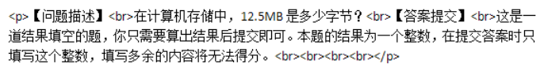

1MB=2^20 ,所以 12.5MB=2**20*12.5bytes

```
print(2**20*12.5)
```


## 2，第二题送分题

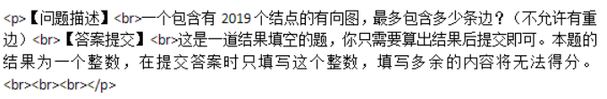

### 最多的边符合有向完全图定义，根据《大话数据结构》p216页提到

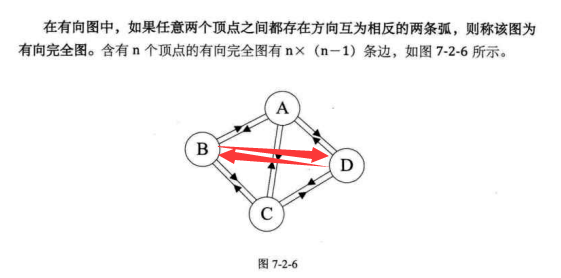

那么最多的边就是2019*2018=4074342条边

```
print(2019*2018)
```


## 3，第三题简单题

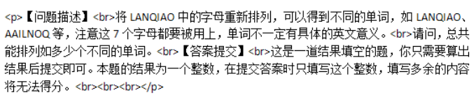


### 考察的是排列组合，容易观察是取出不放回类型，得到结果符合公式

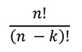

即

```
def factorial(num:int)->int:
    if num==0:
        return 1
    else:
        return num*factorial(num-1)
string = "LANQIAO"
leng=len(string)
print(factorial(leng)/factorial(leng-leng))
```

结果为

```
5040.0
```

当然，这样更快

```
print(7*6*5*4*3*2)
```

## 4，第四题中等题，括号，这更像是一道算法题了

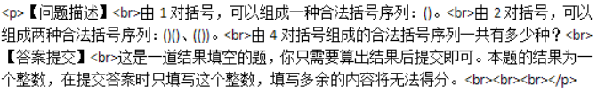


在LeetCode做过一次相似的，当时是用c语言写的一个栈做的，比较复杂，[详细戳这里](https://github.com/ZHKU-Robot/Robot-algorithm-learning/tree/main/Easy/valid-parentheses)

而这里是不同的，这里更像是遍历所有可能寻找合法的括号对，我去LeetCode又找了一下，结果就找到这道是面试题

#### [面试题 08.09. 括号](https://leetcode-cn.com/problems/bracket-lcci/)

括号。设计一种算法，打印n对括号的所有合法的（例如，开闭一一对应）组合。

说明：解集不能包含重复的子集。

例如，给出 n = 3，生成结果为：

```
[
  "((()))",
  "(()())",
  "(())()",
  "()(())",
  "()()()"
]
```

这里实际上是一样的，所以我们直接来做这道算法题

我现在 时间是

 2021年2月17日14:12:08 开始想

2021年2月17日14:21:46 还是没思路 （除了用暴力法,但我不知道怎么生成所有的可能，看官方题解了

方法一：暴力法

思路

> 我们可以生成所有 22n2^{2n}22n 个 '(' 和 ')' 字符构成的序列，然后我们检查每一个是否有效即可。
>
> 算法
>
> 为了生成所有序列，我们可以使用递归。长度为 n 的序列就是在长度为 n-1 的序列前加一个 '(' 或 ')'。
>
> 为了检查序列是否有效，我们遍历这个序列，并使用一个变量 balance 表示左括号的数量减去右括号的数量。如果在遍历过程中 balance 的值小于零，或者结束时 balance 的值不为零，那么该序列就是无效的，否则它是有效的。
>
> 作者：LeetCode-Solution
> 链接：https://leetcode-cn.com/problems/generate-parentheses/solution/gua-hao-sheng-cheng-by-leetcode-solution/
>
> 来源：力扣（LeetCode）
> 著作权归作者所有。商业转载请联系作者获得授权，非商业转载请注明出处。

```python
class Solution:
    def generateParenthesis(self, n: int) :
        def generate(A):
            if len(A) == 2*n:
                if valid(A):
                    ans.append("".join(A))
            else:
                A.append('(')
                generate(A)
                A.pop()
                A.append(')')
                generate(A)
                A.pop()

        def valid(A):
            bal = 0
            for c in A:
                if c == '(':
                    bal += 1
                else:
                    bal -= 1
                if bal < 0:
                    return False
            return bal == 0

        ans = []
        generate([])
        return ans

s=Solution()
print(s.generateParenthesis(3))
```

当然，这里是基于减法的，比较复杂，很容易得到基于增量的递归，从 '' 开始加括号即可，都是用了树形的思想来生成的。。

```python
class Solution:
    def generateParenthesis(self, n: int):
        if n <= 0:
            return []
        res = []
        def generate(paths):
            if len(paths) == n * 2:  # 因为括号都是成对出现的
                res.append(paths)
                return

            generate(paths + '(')
            generate(paths + ')')

        generate('')
        return res


s=Solution()
print(s.generateParenthesis(2))
```

```
['((((', '((()', '(()(', '(())', '()((', '()()', '())(', '()))', ')(((', ')(()', ')()(', ')())', '))((', '))()', ')))(', '))))']
```

但是你会发现有很多不合格的组合，这时候就要进行过滤了

```
class Solution:
    def generateParenthesis(self, n: int) -> List[str]:
        if n <= 0: return []
        res = []

        def dfs(paths, left, right):
            if left > n or right > left: return
            if len(paths) == n * 2:  # 因为括号都是成对出现的
                res.append(paths)
                return

            dfs(paths + '(', left + 1, right)  # 生成一个就加一个
            dfs(paths + ')', left, right + 1)

        dfs('', 0, 0)
        return res


作者：xiao-ben-dan-s
链接：https://leetcode-cn.com/problems/bracket-lcci/solution/sui-ran-bu-shi-zui-xiu-de-dan-zhi-shao-n-xjx1/
来源：力扣（LeetCode）
著作权归作者所有。商业转载请联系作者获得授权，非商业转载请注明出处。
```


之后看了提示1，2

- 尝试简单构建法。
- 假设我们有编写两对括号的所有有效方法。怎么用这个来得到编写三对括号的所有有效方法？

从这个提示可以看出，应该是一道动态规划的题目，巧了，我不会

2021年2月17日14:23:54 直接看其他题解了

大概看懂了点，倒是没想到直接用树的结构去做，也就是所谓的回溯法

 **用 DFS 的方式遍历这棵树，找出所有的解，这个过程叫回溯。** 

> 方法二：回溯法
>
> 思路和算法
>
> 方法一还有改进的余地：我们可以只在序列仍然保持有效时才添加 '(' or ')'，而不是像 方法一 那样每次添加。我们可以通过跟踪到目前为止放置的左括号和右括号的数目来做到这一点，
>
> 如果左括号数量不大于 nnn，我们可以放一个左括号。如果右括号数量小于左括号的数量，我们可以放一个右括号。
>
> 作者：LeetCode-Solution
> 链接：https://leetcode-cn.com/problems/generate-parentheses/solution/gua-hao-sheng-cheng-by-leetcode-solution/
> 来源：力扣（LeetCode）
> 著作权归作者所有。商业转载请联系作者获得授权，非商业转载请注明出处。

```python
class Solution:
    def generateParenthesis(self, n: int) -> List[str]:
        ans = []
        def backtrack(S, left, right):
            if len(S) == 2 * n:
                ans.append(''.join(S))
                return
            if left < n:
                S.append('(')
                backtrack(S, left+1, right)
                S.pop()
            if right < left:
                S.append(')')
                backtrack(S, left, right+1)
                S.pop()

        backtrack([], 0, 0)
        return ans

```

画图大概是这样

  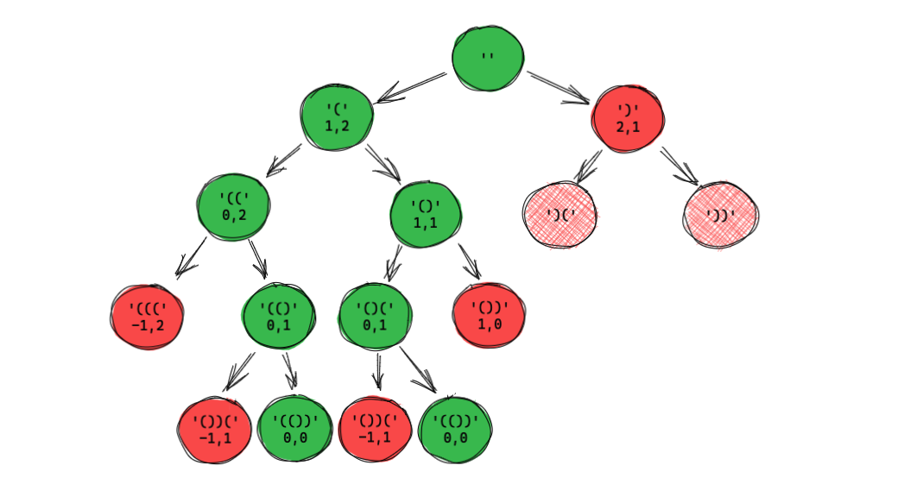  

你就发现，这个其实还挺好懂的，但。。。为啥这么一开始难想出来呢？


实际上，这个数列还是一个Catalan数

>  明安图数，又称卡塔兰数，英文名Catalan number，是[组合数学](https://baike.baidu.com/item/组合数学)中一个常出现于各种计数问题中的[数列](https://baike.baidu.com/item/数列)。以中国蒙古族数学家[明安图](https://baike.baidu.com/item/明安图/24682) (1692-1763)和[比利时](https://baike.baidu.com/item/比利时)的数学家欧仁·查理·卡塔兰 (1814–1894)的名字来命名，其前几项为（从第零项开始） : 1, 1, 2, 5, 14, 42, 132, 429, 1430,  4862, 16796, 58786, 208012, 742900, 2674440, 9694845, 35357670,  129644790, 477638700, 1767263190, 6564120420, 24466267020, 91482563640,  343059613650, 1289904147324, 4861946401452 

**话说了这么多，这题我跪了，所以我选择放弃**

```
['(((())))', '((()()))', '((())())', '((()))()', '(()(()))', '(()()())', '(()())()', '(())(())', '(())()()', '()((()))', '()(()())', '()(())()', '()()(())', '()()()()']
```

### 5，第五题简单题，前一题不要灰心，做不出来没事，继续

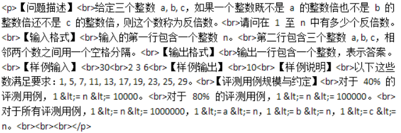

```python
n = 30 #int(input('输入 n'))
a, b, c =2,3,6 # [int(ever) for ever in input('输入a,b,c').split(' ')]
# print(a, b, c)
sum=0
for i in range(n):
    if i%a!=0 and i%b!=0 and i%c!=0:
        print(i)
        sum+=1
print("总数=",sum)
```

```
1
5
7
11
13
17
19
23
25
29
总数是 10
```

## 6，第六题简单题，一个简单的凯撒加密

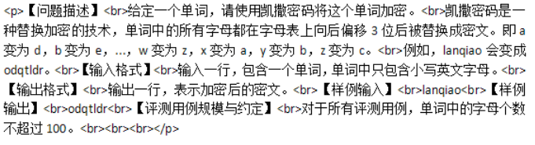

```
origin = "lanqiao"

def encrypt(originstr):
    return ''.join([chr(ord(s) + 3) for s in list(originstr)])

print(encrypt(origin))

```

```
odqtldr
```

## 7，第7题，简单题，其实是考察一个简单的规律

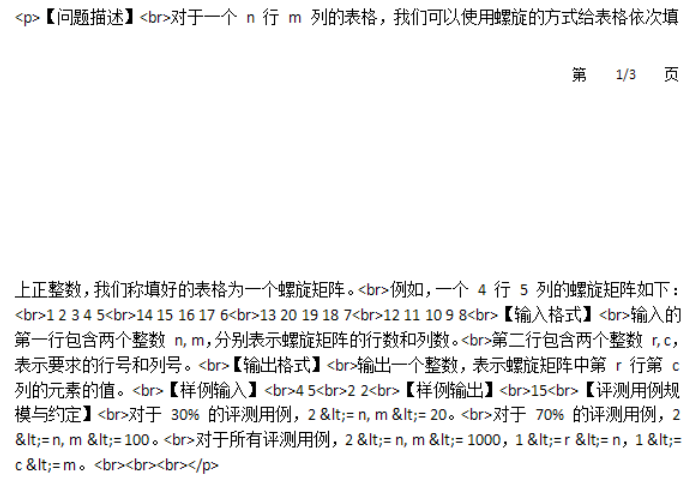


```
# 第0行
# 第n-1列
# 第n-1行
# 第0列
# 第 1 行
# 第 n-2列
# 第 n-2行
# 第 1列
# 以此类推
```

观察一段时间代码规律后，写成这样哦了

```python
n=4
start=1
l=[[0 for i in range(n) ] for j in range(n)]
col=0
row=0
max=n*n
def arrRowSet(row1,row2):
    global start,row
    direation=1 if row1-row2<0 else -1
    for i in range(row1,row2,direation):
        l[i][col]=start
        start+=1
        row+=direation
def arrColSet(col1, col2):
    global start,col
    direation=1 if col1-col2<0 else -1
    for i in range(col1, col2,direation):
        l[row][i] = start
        start += 1
        col+=direation
    col-=1
for i in range(n//2+1):
    arrColSet(i,n-i)
    arrRowSet(i+1,n-i)
    arrColSet(n-i-2,i)
    arrRowSet(n-i-1,i)
    row+=1
    col+=1
for a in l:
    print(a)

```


```
[1, 2, 3, 4, 5]
[16, 17, 18, 19, 6]
[15, 26, 25, 20, 7]
[14, 23, 22, 21, 8]
[13, 12, 11, 10, 9]
```


```
[1, 2, 3, 4, 5, 6]
[20, 21, 22, 23, 24, 7]
[19, 38, 39, 40, 25, 8]
[18, 31, 36, 35, 26, 9]
[17, 30, 37, 28, 27, 10]
[16, 15, 14, 13, 12, 11]
```


# Page 2


##  8，第八题 中等题


​                         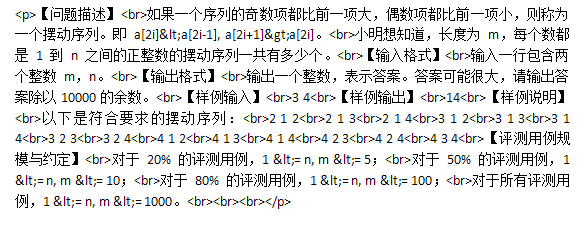

2021年2月18日12:53:07 开始想

2021年2月18日13:39:12 做出来了

有了第4题 递归产生这些的基础，再做这种生成的题，终于有点感觉了。用递归产生额

### 暴力法终于做出来了，我舒服

由于这里是全排列，所以用for循环产生一下所有的可能，哈哈哈，这个递归还可以吧

```python
l = []
def generate(arr):
    global l
    if len(arr)==m:
        l.append(arr)
        return
    for j in range(1,n+1):
        generate(arr+[j])


generate([])

```

```
[[1, 1, 1], [1, 1, 2], [1, 1, 3], [1, 1, 4], [1, 2, 1], [1, 2, 2], [1, 2, 3], [1, 2, 4], [1, 3, 1], [1, 3, 2], [1, 3, 3], [1, 3, 4], [1, 4, 1], [1, 4, 2], [1, 4, 3], [1, 4, 4], [2, 1, 1], [2, 1, 2], [2, 1, 3], [2, 1, 4], [2, 2, 1], [2, 2, 2], [2, 2, 3], [2, 2, 4], [2, 3, 1], [2, 3, 2], [2, 3, 3], [2, 3, 4], [2, 4, 1], [2, 4, 2], [2, 4, 3], [2, 4, 4], [3, 1, 1], [3, 1, 2], [3, 1, 3], [3, 1, 4], [3, 2, 1], [3, 2, 2], [3, 2, 3], [3, 2, 4], [3, 3, 1], [3, 3, 2], [3, 3, 3], [3, 3, 4], [3, 4, 1], [3, 4, 2], [3, 4, 3], [3, 4, 4], [4, 1, 1], [4, 1, 2], [4, 1, 3], [4, 1, 4], [4, 2, 1], [4, 2, 2], [4, 2, 3], [4, 2, 4], [4, 3, 1], [4, 3, 2], [4, 3, 3], [4, 3, 4], [4, 4, 1], [4, 4, 2], [4, 4, 3], [4, 4, 4]]
```

然后就容易写到这样的检查合法性了

```python
# 暴力遍历所有 的可能
def isValid(arr):
    sum=0
    for everarr in arr:
        for arrIndex in range(1,m,2):
            if everarr[arrIndex+1]>everarr[arrIndex] and everarr[arrIndex]<everarr[arrIndex-1]:
                print(''.join([str(i)+' ' for i in everarr]))
                sum+=1
            else:
                break
    print("sum=",sum)

```

 

```
2 1 2 
2 1 3 
2 1 4 
3 1 2 
3 1 3 
3 1 4 
3 2 3 
3 2 4 
4 1 2 
4 1 3 
4 1 4 
4 2 3 
4 2 4 
4 3 4 
sum= 14

Process finished with exit code 0
```

但很遗憾，是过不了压力测试的，直接Stack Overflow了

```
RecursionError: maximum recursion depth exceeded in comparison
```

所以我们需要用回溯的方法再做一次，

2021年2月18日14:20:03 做出来了

```
l = []
flag = 0
sum=0
def generate(arr):
    global l,flag,sum
    for arrIndex in range(1,len(arr)-1):
        flag = 0
        if arr[arrIndex + 1] > arr[arrIndex] and arr[arrIndex] < arr[arrIndex - 1]:
            flag=1
        else:
            return
    if flag:
        if len(arr)==m:
            l.append(arr)
            sum+=1
            return
    for j in range(1,n+1):
        generate(arr+[j])


generate([])
print(l)
print('sum=',sum)
```

```
[[2, 1, 2], [2, 1, 3], [2, 1, 4], [3, 1, 2], [3, 1, 3], [3, 1, 4], [3, 2, 3], [3, 2, 4], [4, 1, 2], [4, 1, 3], [4, 1, 4], [4, 2, 3], [4, 2, 4], [4, 3, 4]]
sum= 14
```

哈哈哈，不错不错，可以！

## 9，第九题 做了我三个小时


这题很明显是求最短代价的题，由《大话数据结构》中有提到，这应该是一个带权无向图求最小生成树的算法

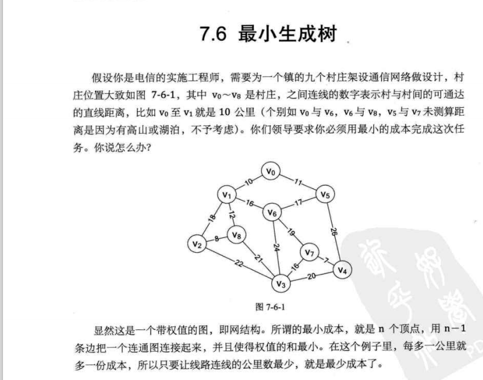

我们首先要初始化这个图

```python
class MGraph:
    def __init__(self):
        self.graphAdjList=GraphAdjList(n,numEdges)
        self.vexs = [0 for _ in range(n)]
        self.arc = [self.vexs.copy() for _ in range(n)]
```

用邻接矩阵的形式创建图和边关系

```python
    def createMGraph(self):
        for i in range(n):
            for j in range(i + 1, n):
                x1, y1, h1 = test[i]
                x2, y2, h2 = test[j]
                cost = math.sqrt(math.pow(x1 - x2, 2) + math.pow(y1 - y2, 2)) \
                       + math.pow(h1 - h2, 2)
                cost=round(cost,2)
                self.arc[i][j] = cost
                self.arc[j][i] = self.arc[i][j]
```

这里的村庄可以互相连接，没有限制，所以这里的边需要全连接，以便计算最小成本


首先打印出来看看邻接矩阵

```
    def showMGraph(self):
        for a in self.arc:
            print(a)
```

```
[0, 27.31, 18.9, 6.0]
[27.31, 0, 2.41, 15.4]
[18.9, 2.41, 0, 9.0]
[6.0, 15.4, 9.0, 0]
```

然后写一个基于邻接矩阵的最小生成树算法

```
 def prim(self):
        min=65535
        adjvex=[0 for _ in range(n)] #相关顶点下标
        lowcost=[0 for _ in range(n)]#相关顶点间的权值
        for i in range(n):
            lowcost[i]=self.arc[0][i]

        for i in range(1,n):
            min=65536
            j=1
            k=0
            while(j<n):
                if lowcost[j]!=0 and lowcost[j]<min:
                    min=lowcost[j]
                    k=j
                j+=1
            print("({}<->{})".format(adjvex[k],k))
            lowcost[k]=0
            for j in range(1,n):
                if(lowcost[j]!=0 and self.arc[k][j]<lowcost[j]):
                    lowcost[j]=self.arc[k][j]
                    adjvex[j]=k
        print('lowcost=', lowcost)
        print('adjvex',adjvex)

        # 计算总共的代价
        sum=0
        for i,v in enumerate(adjvex):

            sum+=self.arc[i][v]
        print("sum=",sum)
```

结果就像这样

```
(0<->3)
(3<->2)
(2<->1)
lowcost= [0, 0, 0, 0]
adjvex [0, 2, 3, 0]
sum= 17.41
```


prim的时间是~

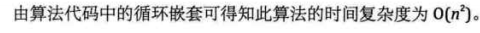


## 10，第十题

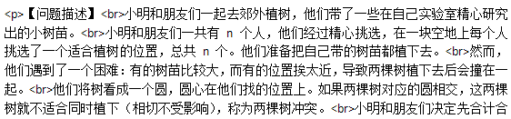

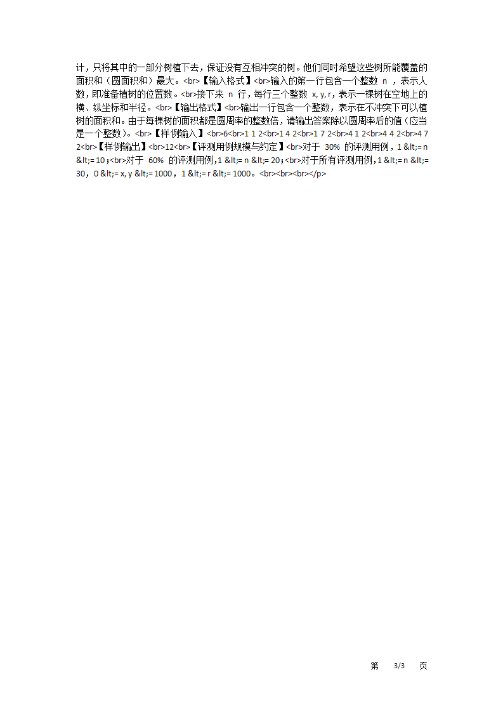


 