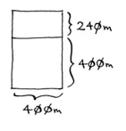
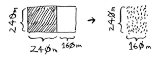
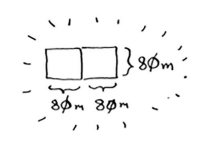
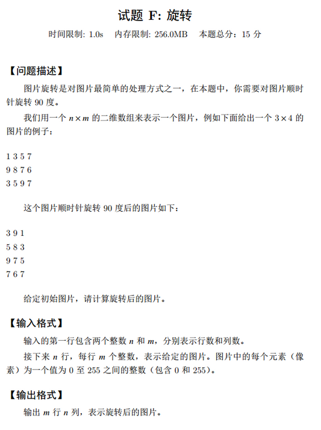

很典型的 D&C 类型，甚至是例题，稍微学过的都是送分的

假设你是农场主，有一小块土地。


你要将这块地均匀地分成方块，且分出的方块要尽可能大。显然，下面的分法都不符合要求。


如何将一块地均匀地分成方块，并确保分出的方块是最大的呢？使用D&C策略！D&C算法 

是递归的。使用D&C解决问题的过程包括两个步骤。 

(1) 找出基线条件，这种条件必须尽可能简单。 

(2) 不断将问题分解（或者说缩小规模），直到符合基线条件。 

下面就来使用D&C找出前述问题的解决方案。可你能使用的最大方块有多大呢？ 

首先，找出基线条件。最容易处理的情况是，一条边的长度是另一条边的整数倍。


如果一边长25 m，另一边长50 m，那么可使用的最大方块为 25 m×25 m。换言之，可以将 

这块地分成两个这样的方块。 

现在需要找出递归条件，这正是D&C的用武之地。根据D&C的定义，每次递归调用都必须 

缩小问题的规模。如何缩小前述问题的规模呢？我们首先找出这块地可容纳的最大方块。


你可以从这块地中划出两个640 m×640 m的方块，同时余下一小块地。现在是顿悟时刻：何 

不对余下的那一小块地使用相同的算法呢？


最初要划分的土地尺寸为1680 m×640 m，而现在要划分的土地更小，为640 m×400 m。适 

用于这小块地的最大方块，也是适用于整块地的最大方块。换言之，你将均匀划分1680 m×640 m 

土地的问题，简化成了均匀划分640 m×400 m土地的问题！

欧几里得算法  

> 前面说“适用于这小块地的最大方块，也是适用于整块地的最大方块”，如果你觉得这一 点不好理解，也不用担心。这确实不好理解，但遗憾的是，要证明这一点，需要的篇幅有点长， 在本书中无法这样做，因此你只能选择相信这种说法是正确的。如果你想搞明白其中的原因， 可参阅欧几里得算法。

下面再次使用同样的算法。对于640 m × 400 m的土地，可从中划出的最 大方块为400 m × 400 m。 



这将余下一块更小的土地，其尺寸为400 m × 240 m。


你可从这块土地中划出最大的方块，余下一块更小的土地，其尺寸为240 m × 160 m。



接下来，从这块土地中划出最大的方块，余下一块更小的土地。


余下的这块土地满足基线条件，因为160是80的整数倍。将这块土地分成两个方块后，将不 会余下任何土地！



因此，对于最初的那片土地，适用的最大方块为80 m× 80 m。


这里重申一下D&C的工作原理： 

(1) 找出简单的基线条件； 

(2) 确定如何缩小问题的规模，使其符合基线条件

D&C并非可用于解决问题的算法，而是一种解决问题的思路

也很显然是一个递归的思路

那么容易写出来为

```
n=0
def dANDc(w,h):
    #基线条件是长等于宽
    global n
    if w==h:
        n+=1
        return 
    else:
        n+=1
        if w>h:
            w= w-h
        else:
            h=h-w
   
        print(w,h)
        dANDc(w,h)
dANDc(2019,324)
print(n)

```

输出依次是

```
1695 324
1371 324
1047 324
723 324
399 324
75 324
75 249
75 174
75 99
75 24
51 24
27 24
3 24
3 21
3 18
3 15
3 12
3 9
3 6
3 3
21
```

希望对了


《简单》只是一个26进制的转换而已啦

但是奇奇怪怪的这题，又说可以两位，又说可以更长位，难道两个答案？

不管了

这里可以用除K取余法来做

用2019 //26=77

2019%26=17

然后

77%26=25

77//26=2

2%26=2

2//26=0

所以

```
# print(chr(ord('A') + 17 - 1))
# print(chr(ord('A') + 25 - 1))
# print(chr(ord('A') + 2 - 1))
```

答案就是

```
BYQ
```


《送分》

如果一个数 只能整除1和它本身，那么这个数被称作质数

```
i=2
c=0
while 1:
    for j in range(2,i+1):
        if i%j==0 and i!=j:
            j=0
            break
        else:
            j=1
    if j:
##        print(i,"是质数")
        c+=1
    i+=1
    if c==2019:
        print(i)
        break
```





嗯。。这。送分题

zip真的太好用啦！！！

```
mrows,ncols=map(int,input().split())
pic=[]
for i in range(mrows):
    pic.append(list(map(int,input().split())))
for rot in list(zip(*pic)):
    print(*rot[::-1])
```

```
3 4
1 3 5 7
9 8 7 6
3 5 9 7

3 9 1
5 8 3
9 7 5
7 6 7
```


一旦到了应用题，就不是那么简单了，读题都不明觉厉，所以。先到这吧


